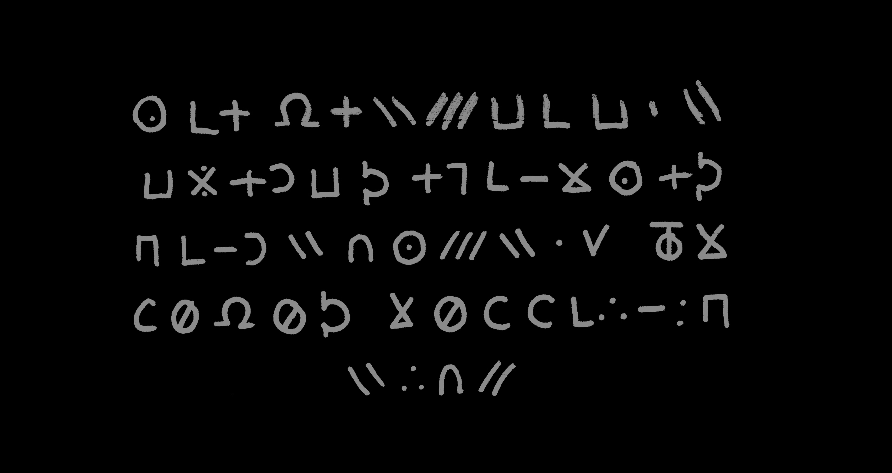
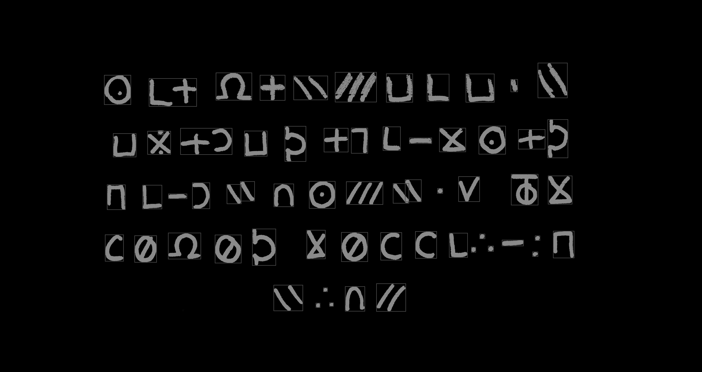
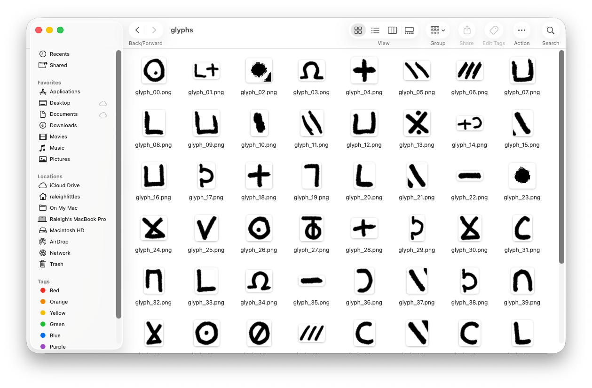

# About

__SIKIP TO THE BOTTOM IF YOU'D LIKE TO SEE THE CODE__

In the movie [Longlegs](https://www.imdb.com/title/tt23468450/) (2024), around the 14 minute mark, a letter from an alleged serial killer in shown. The letter is written in a coded script of mostly non-English characters. I thought it'd be cool if I could turn this into an actual font. After looking into it, it seemed like most of the ways people were doing those involved some type of manual intervention; I wanted to see if this could be done in a completely automated fashion, from start to finish. As it turns out, this seemingly simple task can become complicated when you try to do it automatically.

While it may sound difficult, the process of creating a custom font just involves two steps:

* Step 1: Selecting glyphs (characters)
* Step 2: Packaging the glyphs into a font file

If you're doing this manually, step 1 would be to have an artist draw your glyphs in something like illustrator. The second step would be to import those glyphs into a font editor, assign the mappings, and export the font to a file.

In this post I'm only going to talk about step 1. Using a screenshot of the movie I already have the font glpyhs I need, they're just all in one image. This whole section is going to be about how to extract each glyph in this image, using some image processing techniques.



To start, we need to first "binarize" (also called thresholding) our image to make it easier to process. Font glyphs are always in black, so any other colors other than that are unnecessary.

Formally... the step of thresholding converts an 8-bit grayscale image $I$ into a binary image $B$ where stroke pixels are 1 and background 0. The script uses a global threshold scaled from the image mean:

```math
T=α⋅mean(I) \\\\ B(x,y) = \begin{cases} 1 & I(x,y) > T \\ 0 & \texttt{otherwise.} \end{cases}
```

Here:

```math
\alpha = \textit{THRESHOLD\_SCALE}
```

Next is going to be the step where we find "connected" pixels to identify characters. We'll use a 4-neighborhood BFS/DFS to do this. Formally, we label each connected set $S_k \subset \mathbb{Z}^2$ and compute its bounding box:

```math
\text{bbox}_{k} = (x_{min}, x_{max}, y_{min}, y_{max}) \\
x_{min} = min_{(x,y) \in S_{k}} (x)
```

Small components are discarded by area ( MIN_COMPONENT_AREA )

Handwriting often produces glyphs that break into multiple nearby connected components (dots, diacritics, or stroke gaps). This script groups components into bands (rows) by comparing component vertical centers, then within each band merges components that:

have sufficient vertical overlap (tolerance COMPONENT_VERTICAL_TOLERANCE),

or are close horizontally (COMPONENT_HORIZONTAL_GAP).

This is implemented by scanning the band components left-to-right and greedily merging when the conditions hold. The merge operation simply computes the union of bounding boxes.

This heuristic is fast and effective for rows that are horizontally laid out and where glyphs are separated by gaps, which is exactly what we have in the original image.

For each glyph crop the code extracts a single (largest) contour using OpenCV (findContours) and then normalizes it with a [PCA](https://en.wikipedia.org/wiki/Principal_component_analysis)-based alignment.

After thresholding each glyph image into a binary mask, contours are sequences of points:

```math
C = \{(x_{1}, y_{1}), ... , (x_{m}, y_{m})\}
```

OpenCV’s findContours approximates stroke boundaries as point chains; picking the largest contour reduces spurious small components.

Let $P$ be the $m \times 2$ matrix of contour points. The code centers $P$ by subtracting the centroid $\bar p$:

```math
P_{c} = P - \bar{p}  \\ \\ \bar{p} = \frac{1}{m}\sum^{m}_{i=1} p_{i}
```

To normalize overall size, the code divides by the diagonal of the bounding box:

```math
D = \sqrt{(x_{max} - x_{min})^{2} + (y_{max} - y_{min})^2} \quad \quad P_{n} = \frac{P_{c}}{D}
```

This places contours in a canonical scale independent of writing size.

We can see the results of this by drawing the found bounding box over the original image:



This reveals a key issue: glyphs next to each other are sometimes identified as one connected glyph. You can try to adjust this by changing the horizontal gap parameter, but a side effect of that might be that in the case of glyphs with multiple strokes, those each stroke will be interpreted as a separate glyph. (This is similar to the problem you'd face trying to read a sentence where the words aren't separated by a space).

Now that we have our bounding boxes, we apply a simple de-duplication method using hashing to try to identify duplicates. This approach would work in a situation where the glyphs we're extracting were computer-generated, but with handwriting it is much more difficult - even for simple characters like "L" or "O", think about how dissimilar they'd be from the view of a computer.

If you run the script included, the glyphs will all be extracted to a directory.



This is where we'll leave off. In the next part, we'll discuss how to take these glyphs, and convert them to a usable font file.